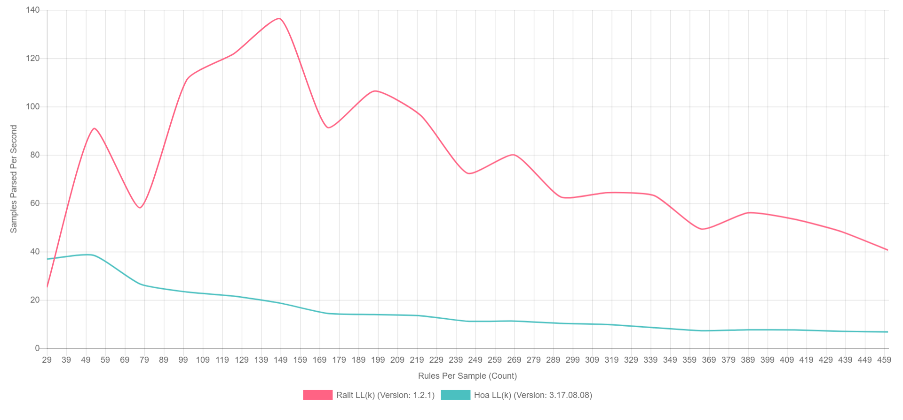

<p align="center">
    
</p>

<p align="center">
    <a href="https://travis-ci.org/railt/parser"></a>
    <a href="https://scrutinizer-ci.com/g/railt/parser/?branch=master"></a>
    <a href="https://scrutinizer-ci.com/g/railt/parser/?branch=master"></a>
    <a href="https://packagist.org/packages/railt/parser"></a>
    <a href="https://packagist.org/packages/railt/parser"></a>
    <a href="https://raw.githubusercontent.com/railt/parser/master/LICENSE.md"></a>
</p>

# Parser

The parser provides a set of components for grammar analysis (Parsing) of the source code 
and converting them into an abstract syntax tree (AST).

For the beginning it is necessary to familiarize with parsing algorithms. This implementation,
although it allows you to switch between runtime, but provides out of the box two 
implementations: [LL(1) - Simple and LL(k) - Lookahead](https://en.wikipedia.org/wiki/LL_parser).

In order to create your own parser we need:
1) Create lexer
2) Create grammar

## Lexer

Let's create a primitive lexer that can handle spaces, numbers and the addition character.

> More information about the lexer can be found in [this repository](https://github.com/railt/lexer).

```php
$lexer = new Railt\Lexer\Driver\NativeStateless();
$lexer->add('T_WHITESPACE', '\\s+', false); 
$lexer->add('T_NUMBER', '\\d+');
$lexer->add('T_PLUS', '\\+');
```

## Grammar

Grammar will be a little more complicated. We need to determine in what order 
the tokens in the source text can be located, which we will parse.

First we start with the [(E)BNF format](https://en.wikipedia.org/wiki/Extended_Backus%E2%80%93Naur_form):

```ebnf
(* A simple example of adding two numbers will look like this: *)
expr = T_NUMBER T_PLUS T_NUMBER ;
```

To define this rule inside the Parser, we simply use two classes that define the rules 
inside the product, this is the [concatenation](https://en.wikipedia.org/wiki/Concatenation) 
and definitions of the tokens.

```php
//
// This (e)BNF construction:
// expression = T_NUMBER T_PLUS T_NUMBER ;
// 
// Looks like:
// Concatenation1 = Token1 Token2 Token1
//
$parser = new Railt\Parser\Parser($lexer, [
    new Railt\Parser\Rule\Concatenation(0, [1, 2, 1], 'expression'),
    new Railt\Parser\Rule\Token(1, 'T_NUMBER'),
    new Railt\Parser\Rule\Token(2, 'T_PLUS'),
]);
```

In order to test the grammar, we can simply parse the source.

```php
echo $parser->parse(Railt\Io\File::fromSources('2 + 2'));
```

Will outputs:
```xml
<Ast>
    <expression offset="0">
        <T_NUMBER offset="0">2</T_NUMBER>
        <T_PLUS offset="2">+</T_PLUS>
        <T_NUMBER offset="4">2</T_NUMBER>
    </expression>
</Ast>
```

But if the source is wrong, the parser will tell you exactly where the error occurred:

```php
echo $parser->parse(Railt\Io\File::fromSources('2 + + 2'));
//                                                  ^
//
// throws "Railt\Parser\Exception\UnexpectedTokenException" with message: 
// "Unexpected token '+' (T_PLUS) at line 1 and column 5"
```

In addition, there are other grammar rules.

### Alternation 

Choosing between several rules.

```php
// EBNF: choice = some | any ;
new Alternation(<RULE_ID>, [<some_ID>, <any_ID>], 'choice');
```

### Concatenation 

Sequence of rules.

```php
// EBNF: concat = some any ololo;
new Concatenation(<RULE_ID>, [<some_ID>, <any_ID>, <ololo_ID>], 'concat');
```

### Repetition

Repeat one or more rules.

```php
// EBNF: repeat zero or more = some*
new Repetition(<RULE_ID>, 0, -1, [<some_ID>], 'repeat zero or more');

// EBNF: repeat one or more = some+
new Repetition(<RULE_ID>, 1, -1, [<some_ID>], 'repeat one or more');

// EBNF: repeat = (some any)*
new Repetition(<RULE_ID>, 0, -1, [<some_ID>, <any_ID>], 'repeat');

// EBNF: repeat zero or one = [some]
new Repetition(<RULE_ID>, 0, 1, [<some_ID>, <any_ID>], 'repeat zero or one');
```

### Token

Refers to the token defined in the lexer.

```php
// Lexer: `->add('T_NUMBER', '\\d+')`
new Token(<RULE_ID>, 'T_NUMBER');

// Lexer: `->add('T_WHITESPACE', '\\s+')`
new Token(<RULE_ID>, 'T_WHITESPACE', false);
```

## Examples

A more complex example of a math:

```ebnf
expression = T_NUMBER operation ( T_NUMBER | expression ) ;
operation = T_PLUS | T_MINUS ;
```

```php
$parser = new Parser($lexer, [
    new Concatenation(0, [8, 6, 7], 'expression'),  // expression = T_NUMBER operation ( ... ) ;
    new Alternation(7, [8, 0]),                     // ( T_NUMBER | expression ) ;
    new Alternation(6, [1, 2], 'operation'),        // operation = T_PLUS | T_MINUS ;
    new Token(8, 'T_NUMBER'),
    new Token(1, 'T_PLUS'),
    new Token(2, 'T_MINUS'),
], [Parser::PRAGMA_ROOT => 'expression']);

echo $parser->parse(File::fromSources('2 + 2 - 10 + 1000'));
```

Result:

```xml
<Ast>
  <expression offset="0">
    <T_NUMBER offset="0">2</T_NUMBER>
    <operation offset="2">
      <T_PLUS offset="2">+</T_PLUS>
    </operation>
    <expression offset="4">
      <T_NUMBER offset="4">2</T_NUMBER>
      <operation offset="6">
        <T_MINUS offset="6">-</T_MINUS>
      </operation>
      <expression offset="8">
        <T_NUMBER offset="8">10</T_NUMBER>
        <operation offset="11">
          <T_PLUS offset="11">+</T_PLUS>
        </operation>
        <T_NUMBER offset="13">1000</T_NUMBER>
      </expression>
    </expression>
  </expression>
</Ast>
```

## Abstract Syntax Tree

An abstract syntax tree provides a set of classes 
that can be represented in one of two ways:

- `Leaf` - Terminal structures, which are represented inside the grammar as tokens.
- `Rule` - Non-terminal structures that are part of the production of grammar.

In the form of interfaces, these classes look like this:

```php
interface NodeInterface 
{
    public function getName(): string;
    public function getOffset(): int;
    public function __toString(): string;
}

interface RuleInterface extends NodeInterface
{
    public function getChildren(): iterable;
    public function getChild(int $index): ?NodeInterface;
}

interface LeafInterface extends NodeInterface
{
    public function getValue(): string;
}
```

The name and location offset (in bytes) are part of their 
common capabilities. However, terminals have the ability to retrieve 
values, and non-terminal contain descendants.

As you can see, each node has the `__toString` method, so the **XML** string
of these rules is just a representation of their internal structure.

## Delegate

Each **Rule** can be represented as its own structure, different from the 
standard. To do this, you only need to define in the 
parser when to delegate this authority.

```php
// operation = T_PLUS | T_MINUS ;

class Operation extends Rule 
{
    public function isMinus(): bool 
    {
        return $this->getChild(0)->getName() === 'T_MINUS';
    }
    
    public function isPlus(): bool 
    {
        return $this->getChild(0)->getName() === 'T_PLUS';
    }
}

$parser->addDelegate('operation', Operation::class);

echo $parser->parse('2 + 2');
```

```xml
<Ast>
  <expression offset="0">
    <T_NUMBER offset="0">2</T_NUMBER>
    <operation offset="2">
      <T_PLUS offset="2">+</T_PLUS>
    </operation>
    <T_NUMBER offset="4">2</T_NUMBER>
  </expression>
</Ast>
```

Each **operation** rule will be an instance of `Operation` class.

## Benchmarks

## Benchmarks

- PHP 7.1 (x64 NTS)
    - XDebug: **disabled**
    - Opcache: **disabled**
- Intel i7 6700k
- 16Gb DDR4

[](./resources/public/bench.png)

**Legend:**

- Y Axis: Number of AST rules that can be processed per second.
- X Axis: The total number of rules (and the amount of source code that is processed, including).

- Red: The Railt **Railt LL(k)** parser version 1.2
- Green: The original **Hoa LL(k)** parser version 3.17.08.08

